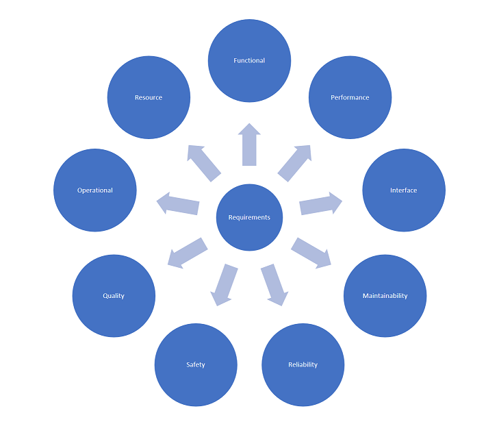
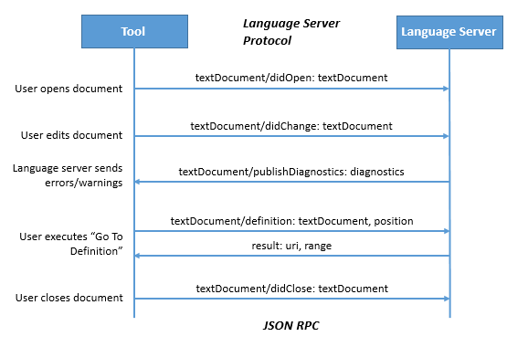

# Elm Language Server Requirements Specification

## Introduction

### Purpose
This document describes the Elm Language Server (ElmLS). Elm Language Server designed to service IDEs and other tools for the [Elm language](http://elm-lang.org/). It should offer an access point to compilation and APIs for getting information about a program.

This document and repository is intended to help as a working document to collect and coordinate requirements and effort to implement the Elm Language Server.

I plan to have this document as a main working document, but that discussion is discussed in github issues in this repository and concluded here. The requirements are separated for functionality/architecture/technical etc, but we can work out this separation together.
I will accept PR's, but I will also appreciate and accept any main collaborators to have full access to this repository.
Please discuss strategy and how to work in this document here: [#2](../../issues/2)

There are many different types of requirements, and this document will try to categorize requirements like this:

### Intended audience
* People working on Elm compiler and other tools
* Editor plugin authors

### Scope
* Create a shared tool to be used by all editors and tools
* Primarily, this is a requirements document, leaving implementation details for later.
* Describe benefits, objectives, what the language server will (not) do.

### History
The elm-oracle implements a core of features, but since it was written, editor plugin authors have figured out how to support a larger set of features.

There has been some efforts and discussions earlier related to creating language server.
* [Discussion - joining forces to create language server](https://github.com/Krzysztof-Cieslak/vscode-elm/issues/137)
* [Elm discuss - Evolving elm-reactor](https://groups.google.com/forum/#!topic/elm-dev/aDWFBg72Wt4)
* [Elm-lang projects - Centralizing Editor Features](https://github.com/elm-lang/projects/wiki/Centralizing-Editor-Features)
* [Elm-lang projects - Editor features](https://github.com/elm-lang/projects/wiki/Editor-Features)
* [Elm-light plugin features](https://gist.github.com/rundis/433d67aaf3f35eb74e66172db3e73c06)
* [Elm-jutsu plugin features](https://docs.google.com/spreadsheets/d/14uGbf6432uYtkusJ3xktWTjqHS3Wm11fCTb1yGbIj8Y/edit#gid=0)
* Has there been any discussion on #gsoc Slack on this issue?

### Motivation
Many editors have Elm support: Atom, Brackets, Emacs, IntelliJ, Light Table, Sublime Text, Vim, and VS Code.

They have many overlapping features, and in many cases, they are implemented independently. It would be great to create a binary that provided as many of these features as possible. That way editor authors have an easier life and we only need to get it right once.

Here is a current status of features supported in the different editors: [Elm Editor support comparision sheet](https://docs.google.com/spreadsheets/d/1JJ21llMKaIYzy449ILvyzQCCmoapJxbVGr-FyRUgKCw/edit#gid=0)
Most of these features has been implemented by a compination of elm-oracle and custom parsers created for each plugin.

Many other languages already benefit from having a language server implementation, providing an effective way to support features across many editors. See the references chapter for implementations.

Many editors support the Language Server Protocol. This protocol is a set of features/APIs that a language server can expose as part of it's features. An important issue to be resolved here is whether or not ElmLS should implement LSP.

### Definitions
* LSP - Language Server Protocol
* ElmLS - Elm Language Server (This name can be discussed)

### Alternatives and existing implementations/references
* [Haskell IDE Engine](https://github.com/haskell/haskell-ide-engine)
* [Rust Language server](https://github.com/rust-lang-nursery/rls)
* [Python Language server](https://github.com/palantir/python-language-server)
* [Other implementations - Language server protocol implementations and editor support](https://github.com/Microsoft/language-server-protocol/wiki/Protocol-Implementations)

### Language Server Protocol
The Language Server Protocol [(introduced in this blog post)](https://code.visualstudio.com/blogs/2016/06/27/common-language-protocol)
is used between a tool (the client) and the language server to integrate features used by the client. The protocol is based on  [JSON-RPC v2.0](http://www.jsonrpc.org/specification)

Discuss here [#3](../../issues/3)

* [Main page for Language Server Protocol:](https://github.com/Microsoft/language-server-protocol)
* [Language Server Protocol/API](https://github.com/Microsoft/language-server-protocol)

### References
* [Language server protocol implementations and editor support](https://github.com/Microsoft/language-server-protocol/wiki/Protocol-Implementations)
* [Haskell IDE Engine (LSP)](https://github.com/haskell/haskell-ide-engine)
* [Language Server Protocol - protocol details](https://github.com/Microsoft/language-server-protocol/blob/master/protocol.md)
* [Language server protocol blog post](https://code.visualstudio.com/blogs/2016/06/27/common-language-protocol)
* [Language Server Protocol](https://github.com/Microsoft/language-server-protocol)

### Overview
This is the actual requirements specification.
## Overall description
### Language server
#### Plugin interfaces
Should cover any interfaces to plugins.
#### Other interfaces
Any other interfaces to elm tooling.
### Design constraints
### Language server functions

This is just a temporary list. Please discuss main features here [#1](../../issues/1)
* Jump to definition
* Find/highlight all references to an item
* Types on hover
* Autocompletions
* Inline Errors
* Show compilation errors and warnings, updated as the user types
* Refactoring

### User/Plugin/Editor characteristics
### Constraints, assumptions and dependencies
## Specific requirements
### Functional requirements - detailed

This is just a temporary placeholder. Please discuss each separate issue and then we could conclude details here later.
* Jump to definition
* Find/highlight all references to an item
* Types on hover
* Autocompletions
  * Based on names - what is in scope, or top-level names in any dep
  * Based on types - like default values and values in scope
  * Based on structure - like let and case
* Errors/inline Errors
* Show compilation errors and warnings, updated as the user types
* Refactoring
  * Reliable rename
  * lift to new let
  * lift to existing let
  * lift to top-level
### Architecture
Discussed in issue #0

### Technical requirements
Discussed in issue #0

### Software system attributes
* Reliability
* Availability
* Security
* Performance
* Maintainability
* Versioning
## Planning / Incremental approach
To avoid waiting too long for a final solution, we should aim to have an incremental approach, delivering value early.
## Other/Discussion
There will be other discussions on topics not mentioned here, also on implementation. Please create any issues and reference them here.

